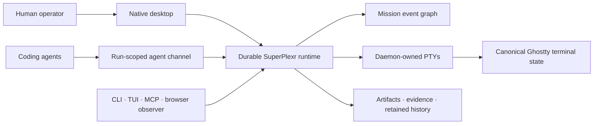

<p align="center">
  
</p>

<p align="center">
  Run, observe, interrupt, delegate, and review parallel agent work from one durable workspace.
</p>

<p align="center">
  <a href="https://github.com/debpalash/superplexr/actions/workflows/ci.yml"></a>
  <a href="LICENSE"></a>
  
  
</p>

SuperPlexr is an open-source, native **agentic terminal multiplexer** for
developers coordinating multiple coding agents. Its durable state is a graph of
Missions, Runs, Sessions, Signals, and Artifacts—not a collection of terminal
windows.

Close the desktop and the daemon-owned terminals keep running. Reopen it and the
same sessions, terminal state, run history, dependencies, and human-attention
queue are still there.

> **Launch status:** SuperPlexr is pre-release software at `0.1.0`. The macOS
> source build is usable today. Linux support and packaging are implemented and
> remain behind the published cross-platform release gates.

## See it in action

<p align="center">
  
</p>

This capture shows the read-only browser observer connected to a disposable real
runtime: switching durable Sessions, searching retained terminal history, and
opening another live view without taking control from the operator.

## Why SuperPlexr

| A terminal multiplexer gives you… | SuperPlexr adds… |
|---|---|
| Persistent shell processes | Durable Missions and Runs with explicit outcomes |
| Windows, tabs, and panes | A responsive waterfall of terminal Surfaces |
| Raw terminal output | Structured progress, questions, approvals, and artifacts |
| Manual process switching | Dependency-aware scheduling for parallel coding agents |
| Shared input | One auditable Control lease with scoped observers/controllers |
| Scrollback | Searchable retained history and deterministic replay |
| Exit codes | Candidate, verification, evidence, and human settlement records |

SuperPlexr does not depend on one agent vendor. A configured engine driver can
launch any command-line coding agent with structured arguments and a restricted,
Run-scoped local channel.

## Product highlights

- **Durable terminals** — real PTYs live in a local daemon and survive desktop
  restarts, with canonical terminal state powered by `libghostty-vt`.
- **Mission graph** — model parallel attempts, lineage, dependencies, priorities,
  outcomes, and review separately from terminal process lifetime.
- **Attention queue** — questions, blockers, approval requests, and failures
  surface as structured Signals instead of terminal-text heuristics.
- **Human control** — take and return exclusive terminal control explicitly;
  observer and controller Shares stay scoped and revocable.
- **Verified delivery** — freeze a candidate, execute bounded checks in an
  independent verifier Run, retain evidence, then accept or return the work.
- **Several clients, one runtime** — native GPUI desktop, CLI, TUI, MCP bridge,
  browser observer, and remote attachment use the same authoritative state.
- **Local-first security** — owner-only state, peer-PID-authenticated agent
  channels, redacted diagnostics, and optional fail-closed workspace-write
  sandboxing.

## Quick start

### Requirements

- macOS 13+ or Linux with Wayland/X11 development libraries
- [Rust 1.97.1](rust-toolchain.toml)
- Zig 0.16.0 on `PATH` for the pinned Ghostty terminal dependency

### Run the native desktop

```sh
git clone https://github.com/debpalash/superplexr.git
cd superplexr
cargo run -p superplexr-desktop
```

The desktop starts its exact-version local runtime, restores Mission tabs, and
reattaches durable Sessions. Use <kbd>Cmd</kbd>/<kbd>Ctrl</kbd>+<kbd>K</kbd> for
the command deck. Graphite and Paper themes are available under **View → Theme**.

### Try the control plane

Start the runtime:

```sh
cargo run -p superplexr-server
```

Then create a Mission and inspect the runtime from another terminal:

```sh
cargo run -p superplexr-cli -- create "Ship the first agent-native terminal"
cargo run -p superplexr-cli -- list
cargo run -p superplexr-cli -- status
```

Every command accepts `--socket`. The runtime persists its event journals and
terminal history under `.superplexr/` by default. Run `superplexr --help` for
remote attachment, Shares, scheduling, verification, replay, and terminal
automation.

## How it works



The runtime owns processes and durable state. Clients are disposable projections:
closing a Surface does not end a Session, and closing a Mission tab does not end
the Mission. The local protocol carries sequenced binary terminal frames beside
structured JSON control events.

## Project status

The repository includes working implementations of the desktop, runtime, CLI,
TUI, MCP bridge, browser observer, durable PTYs, Mission graph, scheduler,
structured Signals, remote owner attachment, scoped Shares, retained history,
and verification workflow.

Release claims are evidence-based. The current macOS results and outstanding
Wayland/X11, packaging, signing, and long-duration gates are recorded in the
[release evidence ledger](docs/engineering/m2-runtime-release-evidence.md) and
[product completion matrix](docs/engineering/product-completion-matrix.md).

## Documentation

| Start here | What it covers |
|---|---|
| [Product specification](docs/spec/README.md) | Normative product and engineering contract |
| [Desktop interaction design](docs/design/browser-waterfall-v1.md) | Mission tabs, Session sidebar, terminal waterfall, attention |
| [System architecture](docs/spec/03-system-architecture.md) | Module boundaries and dependency direction |
| [Local protocol](docs/spec/05-local-protocol.md) | Negotiation, sequencing, terminal frames, control messages |
| [Security and reliability](docs/spec/07-security-and-reliability.md) | Trust boundaries, authority, recovery, limits |
| [Universal runtime and clients](docs/architecture/universal-runtime-and-clients.md) | Native, terminal, web, MCP, and remote-client direction |
| [Brand guide](docs/brand.md) | Name, logo, color, typography, and voice |
| [North star](docs/product/north-star.md) | Product thesis and measurable differentiation gates |

The canonical domain vocabulary lives in [CONTEXT.md](CONTEXT.md). It explains
why a Mission is not a workspace, a Run is not a Session, and a Surface never
owns the process it displays.

## Frequently asked questions

### What is SuperPlexr?

SuperPlexr is a local-first execution environment and terminal multiplexer for
parallel coding agents. It combines persistent terminal sessions with an
event-sourced graph of work, structured human attention, scoped control, and
reviewable delivery evidence.

### Is SuperPlexr a replacement for tmux or Zellij?

It can cover durable terminal-session workflows, but its organizing model is
different. Traditional multiplexers arrange streams. SuperPlexr coordinates the
actors, dependencies, decisions, and artifacts behind those streams.

### Which coding agents does it support?

SuperPlexr uses command-based engine drivers, so it can launch any CLI agent that
can be described with a program, structured arguments, environment changes, and
an optional workspace-write sandbox. The runtime protocol is vendor-neutral.

### Does SuperPlexr send terminal data to a cloud service?

No cloud service is required. The default runtime, terminal journals, Mission
events, and control socket stay on the machine where SuperPlexr runs. Remote and
shared access must be enabled explicitly.

### Is it production-ready?

Not yet. Version `0.1.0` is an early source release for contributors and
technical evaluators. The repository keeps unpassed release gates visible rather
than turning planned work into marketing claims.

## Contributing

Contributions are welcome. Read [CONTRIBUTING.md](CONTRIBUTING.md) for the build,
test, design, and pull-request workflow. Security issues should follow
[SECURITY.md](SECURITY.md).

SuperPlexr is available under the [MIT License](LICENSE).
