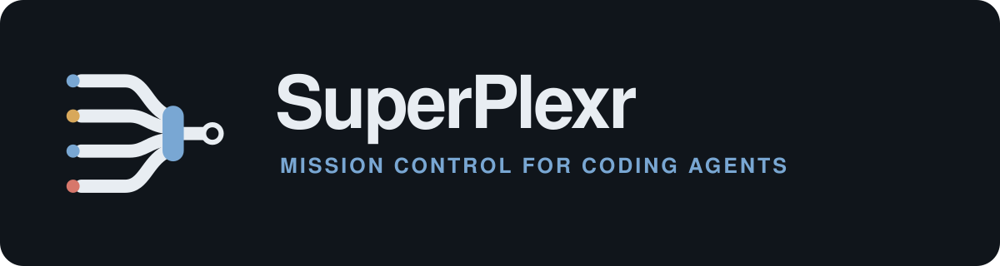
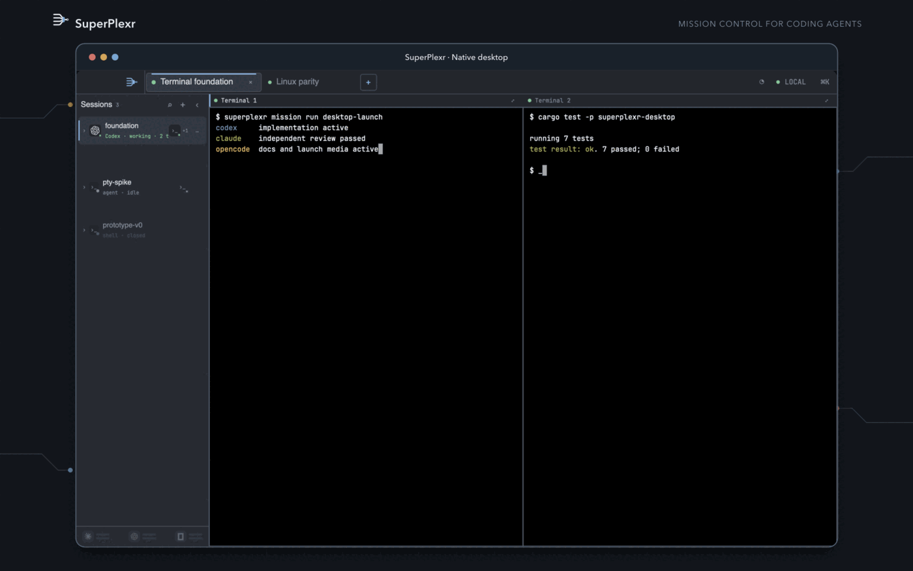
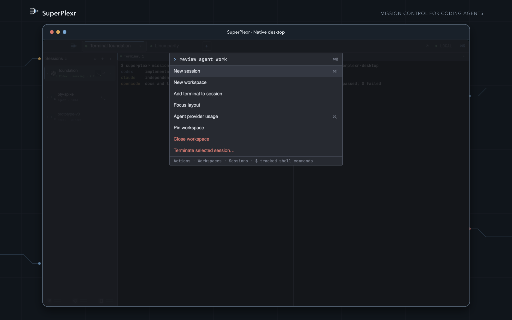
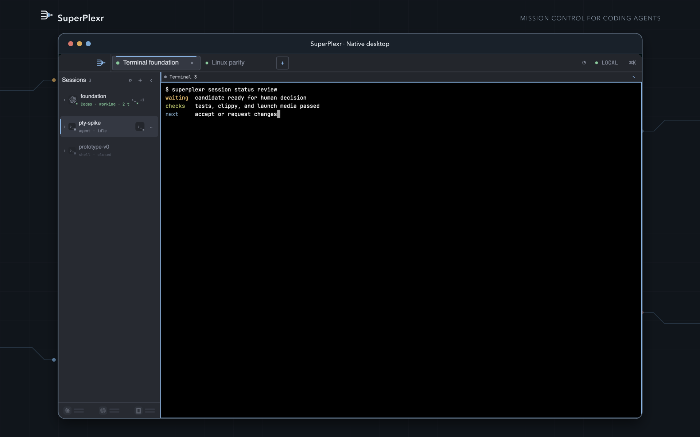
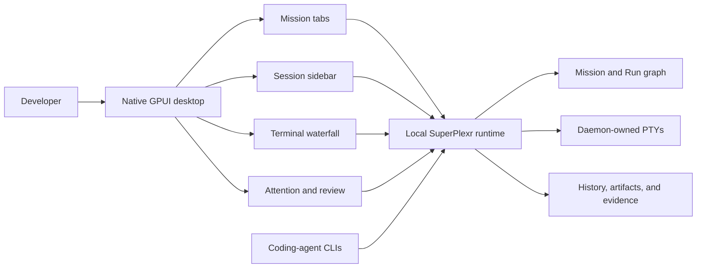
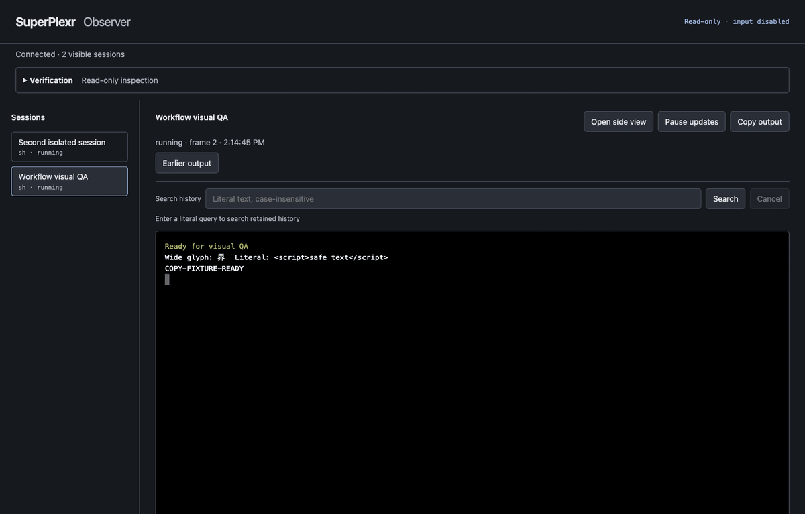

<p align="center">
  
</p>

<p align="center">
  <strong>A native desktop command center for running parallel coding agents.</strong><br>
  Keep every terminal, agent run, question, decision, and result in one durable workspace.
</p>

<p align="center">
  <a href="https://github.com/debpalash/superplexr/actions/workflows/ci.yml"></a>
  <a href="LICENSE"></a>
  
  
</p>

<p align="center">
  
</p>

<p align="center"><sub>Actual GPUI desktop rendering on the branded SuperPlexr launch wallpaper.</sub></p>

## A GUI for parallel agent work

**Yes, SuperPlexr has a desktop GUI.** The main product is a native macOS and
Linux application built in Rust with GPUI. It gives developers one visual place
to launch, supervise, interrupt, and review several coding-agent sessions.

The desktop is organized around work rather than terminal windows:

- **Mission tabs** keep one outcome and all of its activity together.
- **Session sidebar** shows active, waiting, finished, and attention-needing work.
- **Terminal waterfall** lays out several live terminal surfaces without hiding
  them behind a tab stack.
- **Command deck** provides keyboard-first navigation and actions with
  <kbd>Cmd</kbd>/<kbd>Ctrl</kbd>+<kbd>K</kbd>.
- **Run graph and verification views** connect agent attempts, dependencies,
  candidates, checks, and human decisions.
- **Graphite and Paper themes** provide dark and light native interfaces.

The desktop can close without killing the work. A local SuperPlexr runtime owns
the PTYs and durable state, so reopening the app reattaches to the same sessions,
terminal history, Mission graph, and attention queue.

<table>
  <tr>
    <td width="50%">
      
      <br><sub><strong>Command deck:</strong> search actions, workspaces, Sessions, and tracked commands.</sub>
    </td>
    <td width="50%">
      
      <br><sub><strong>Focus mode:</strong> give one Session the window without losing its Mission context.</sub>
    </td>
  </tr>
</table>

## Why developers use it

| When parallel agents create… | The SuperPlexr desktop gives you… |
|---|---|
| Too many terminal windows | One Mission tab with a Session sidebar and waterfall |
| Constant context switching | Stable views that never focus themselves on new output |
| Hidden questions and blockers | Structured attention tied to the requesting Run and Session |
| Unclear ownership of a terminal | Explicit, auditable human and agent Control leases |
| Several competing attempts | A causal Run graph with dependencies and outcomes |
| “Done” without proof | Candidate, verification, evidence, and acceptance records |
| Lost work after closing a client | Daemon-owned PTYs, retained history, and deterministic reattach |

SuperPlexr is agent-vendor neutral. Its engine drivers launch command-line coding
agents from structured process definitions, so the workspace is not tied to one
model provider or agent CLI.

## Run the desktop app

SuperPlexr is currently a `0.1.0` source preview. The macOS source build is usable
today. Linux desktop support is implemented and still needs the published
Wayland, X11, and packaging release gates.

### Requirements

- macOS 13+, or Linux with Wayland/X11 development libraries
- [Rust 1.97.1](rust-toolchain.toml)
- Zig 0.16.0 on `PATH` for the pinned Ghostty terminal dependency

```sh
git clone https://github.com/debpalash/superplexr.git
cd superplexr
cargo run -p superplexr-desktop
```

The desktop starts its matching local runtime automatically, opens a native
window, restores Mission tabs, and reattaches any durable Sessions. You do not
need to start a separate server for the normal desktop workflow.

Useful desktop shortcuts:

| Action | macOS | Linux |
|---|---|---|
| Command deck | <kbd>Cmd</kbd>+<kbd>K</kbd> | <kbd>Ctrl</kbd>+<kbd>K</kbd> |
| New Mission workspace | <kbd>Cmd</kbd>+<kbd>T</kbd> | <kbd>Ctrl</kbd>+<kbd>Shift</kbd>+<kbd>T</kbd> |
| New Session | <kbd>Cmd</kbd>+<kbd>N</kbd> | <kbd>Ctrl</kbd>+<kbd>Shift</kbd>+<kbd>N</kbd> |
| New terminal Surface | <kbd>Cmd</kbd>+<kbd>D</kbd> | <kbd>Ctrl</kbd>+<kbd>Shift</kbd>+<kbd>D</kbd> |
| Focus mode | <kbd>Cmd</kbd>+<kbd>Shift</kbd>+<kbd>Enter</kbd> | <kbd>Ctrl</kbd>+<kbd>Shift</kbd>+<kbd>Enter</kbd> |

## Desktop and runtime architecture



The desktop is the primary operator interface. The runtime owns processes,
terminal state, control authority, and Mission history. This split lets the GUI
restart or reconnect without making a view responsible for process lifetime.

## What ships in this repository

- Native GPUI desktop for macOS and Linux
- Local durable runtime and daemon-owned PTYs
- Ghostty-based terminal parsing and rendering
- Mission, Run, Session, Signal, Intervention, and Artifact model
- Dependency-aware agent scheduler and configurable engine drivers
- Structured attention, Control handoff, history search, and replay
- Candidate review and independent verification workflow
- CLI, TUI, MCP bridge, browser observer, and remote attachment clients
- Scoped observer/controller Shares and local-first security boundaries

The CLI and other clients use the same runtime as the GUI. For example:

```sh
cargo run -p superplexr-cli -- list
cargo run -p superplexr-cli -- status
cargo run -p superplexr-cli -- terminal-list
```

<details>
<summary>Browser observer preview</summary>

The browser observer is a secondary, scoped client for watching or sharing a
Session. It is not the SuperPlexr desktop app.

<p align="center">
  
</p>

</details>

## Project status

SuperPlexr is pre-release software for contributors and technical evaluators.
The repository contains working implementations of the desktop, runtime, CLI,
TUI, MCP bridge, browser observer, durable PTYs, Mission graph, scheduler,
structured Signals, scoped Shares, retained history, and verification workflow.

Release claims remain tied to evidence. Current macOS results and outstanding
Linux, packaging, signing, and long-duration checks are recorded in the
[release evidence ledger](docs/engineering/m2-runtime-release-evidence.md) and
[product completion matrix](docs/engineering/product-completion-matrix.md).

## Documentation

| Start here | What it covers |
|---|---|
| [Desktop experience](docs/spec/06-desktop-experience.md) | Mission tabs, sidebar, waterfall, attention, and keyboard model |
| [Product specification](docs/spec/README.md) | Normative product and engineering contract |
| [System architecture](docs/spec/03-system-architecture.md) | Desktop, runtime, terminal, and storage boundaries |
| [Local protocol](docs/spec/05-local-protocol.md) | Negotiation, sequencing, terminal frames, and control messages |
| [Security and reliability](docs/spec/07-security-and-reliability.md) | Trust boundaries, authority, recovery, and limits |
| [Brand guide](docs/brand.md) | Name, logo, color, typography, and voice |

The canonical vocabulary is in [CONTEXT.md](CONTEXT.md): a Mission is an
outcome, a Run is an attempt, a Session owns process lifetime, and a Surface is
only a view.

## Frequently asked questions

### Is SuperPlexr a desktop application?

Yes. SuperPlexr's primary interface is a native Rust and GPUI desktop app for
macOS and Linux. The repository also includes CLI, TUI, MCP, browser-observer,
and remote clients for the same durable runtime.

### What does the SuperPlexr GUI show?

The GUI shows browser-style Mission tabs, a per-Mission Session and attention
sidebar, a responsive waterfall of live terminal Surfaces, a command deck, Run
details, graph inspection, verification state, Faults, and provider status.

### Is SuperPlexr a replacement for tmux or Zellij?

It covers durable terminal-session workflows, but it organizes them around
parallel agent work. Missions, Runs, structured attention, explicit Control, and
verification records remain first-class instead of being inferred from panes.

### Does SuperPlexr require a cloud service?

No. The desktop, runtime, PTYs, terminal journals, Mission events, and local
control socket run on your machine. Remote and shared access are opt-in.

### Is SuperPlexr production-ready?

Not yet. Version `0.1.0` is an early source release. The repository keeps
unpassed release gates visible instead of presenting planned work as shipped.

## Contributing

Read [CONTRIBUTING.md](CONTRIBUTING.md) for the build, test, design, and
pull-request workflow. Report security issues through [SECURITY.md](SECURITY.md).

SuperPlexr is available under the [MIT License](LICENSE).
