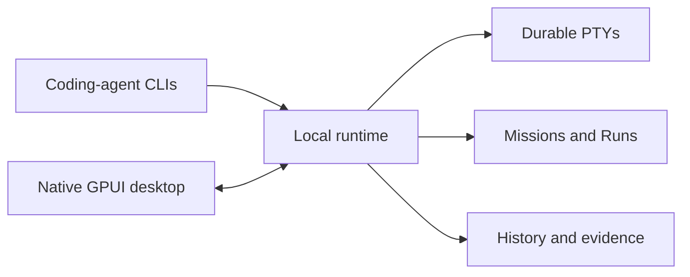

<p align="center">
  
</p>

<p align="center">
  <strong>The native agent multiplexer.</strong><br>
  Run coding agents in parallel. Keep every terminal, decision, and result in one durable workspace.
</p>

<p align="center">
  <a href="https://github.com/debpalash/superplexr/actions/workflows/ci.yml"></a>
  <a href="LICENSE"></a>
  
  
</p>

<p align="center">
  
</p>

SuperPlexr is an open-source desktop app for launching, supervising, and reviewing
multiple terminal-based coding agents. Think tmux for agent work, with Missions,
attention, durable state, and verification built in.

## Why SuperPlexr

| Parallel-agent problem | SuperPlexr |
|---|---|
| Too many terminal windows | One Mission with a Session sidebar and terminal waterfall |
| Hidden blockers | Waiting and attention states stay visible |
| Lost work after closing a window | Runtime-owned PTYs and deterministic reattach |
| Competing attempts | Run graph, candidates, evidence, and review |
| Unclear control | Explicit human and agent Control leases |

Use named engine drivers to connect the coding-agent CLIs you already run.
SuperPlexr stays local by default and does not require a cloud service.

## Native desktop

- **Mission tabs** organize work by outcome.
- **Session sidebar** shows working, waiting, idle, and finished agents.
- **Terminal waterfall** keeps several live terminals visible.
- **Command deck** makes navigation and actions keyboard-first.
- **Focus mode** expands one Session without losing its Mission context.
- **Review flow** connects candidates, checks, evidence, and decisions.

<table>
  <tr>
    <td width="50%">
      
      <br><sub><strong>Command deck</strong></sub>
    </td>
    <td width="50%">
      
      <br><sub><strong>Focus mode</strong></sub>
    </td>
  </tr>
</table>

## Run it

SuperPlexr `0.1.0` is a source preview. The macOS build is usable today. Linux
desktop code is present, with Wayland, X11, and packaging release gates still open.

**Requirements:** macOS 13+ or Linux development libraries, [Rust 1.97.1](rust-toolchain.toml),
and Zig 0.16.0 for the pinned Ghostty dependency.

```sh
git clone https://github.com/debpalash/superplexr.git
cd superplexr
cargo run -p superplexr-desktop
```

The desktop starts its local runtime automatically and reconnects to durable
Sessions when reopened.

| Action | macOS | Linux |
|---|---|---|
| Command deck | <kbd>Cmd</kbd>+<kbd>K</kbd> | <kbd>Ctrl</kbd>+<kbd>K</kbd> |
| New Mission | <kbd>Cmd</kbd>+<kbd>T</kbd> | <kbd>Ctrl</kbd>+<kbd>Shift</kbd>+<kbd>T</kbd> |
| New Session | <kbd>Cmd</kbd>+<kbd>N</kbd> | <kbd>Ctrl</kbd>+<kbd>Shift</kbd>+<kbd>N</kbd> |
| Focus mode | <kbd>Cmd</kbd>+<kbd>Shift</kbd>+<kbd>Enter</kbd> | <kbd>Ctrl</kbd>+<kbd>Shift</kbd>+<kbd>Enter</kbd> |

## How it works



The runtime owns processes and state. The desktop can restart without killing
agent work. CLI, TUI, MCP, browser observer, and remote clients use the same runtime.

```sh
cargo run -p superplexr-cli -- list
cargo run -p superplexr-cli -- status
```

<details>
<summary>Browser observer preview</summary>

The browser observer is a scoped secondary client for watching or sharing a Session.

<p align="center">
  
</p>

</details>

## Release status

| Area | State |
|---|---|
| macOS source build | Usable preview |
| Linux source | Implemented; native release validation open |
| Signed installers | Not published |
| Production readiness | Pre-release |

See the [release evidence ledger](docs/engineering/m2-runtime-release-evidence.md)
and [completion matrix](docs/engineering/product-completion-matrix.md) for exact
passed and open gates.

## Docs

- [Desktop experience](docs/spec/06-desktop-experience.md)
- [Product specification](docs/spec/README.md)
- [Architecture](docs/spec/03-system-architecture.md)
- [Security and reliability](docs/spec/07-security-and-reliability.md)
- [Brand guide](docs/brand.md)

Contributions are welcome. Read [CONTRIBUTING.md](CONTRIBUTING.md), report security
issues through [SECURITY.md](SECURITY.md), and use SuperPlexr under the [MIT License](LICENSE).
